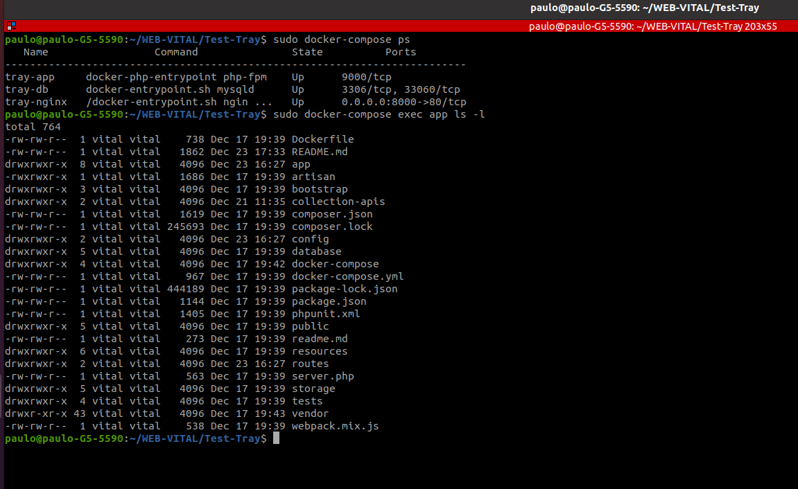
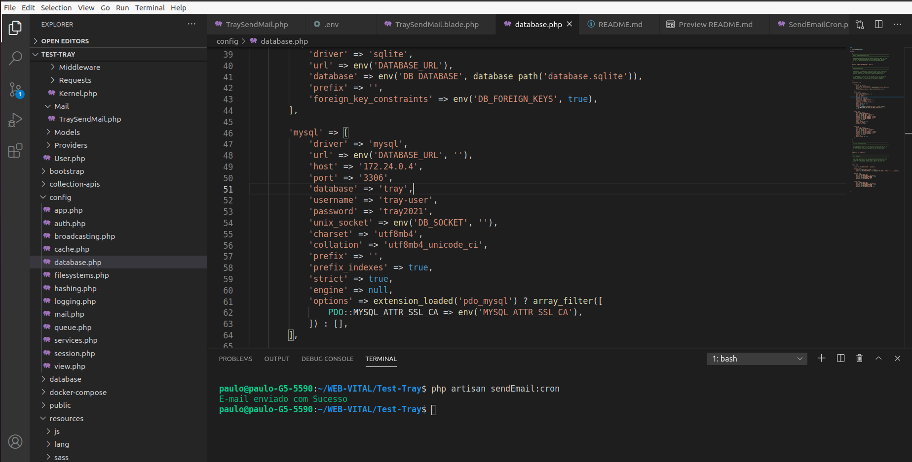

# Teste-Tray

# Realizado em um sistema Linux

---
## Subindo o Docker para rodar o app
1. **sudo docker-compose build app**
2. **sudo docker-compose up -d**
3. 

---
## Instalar as dependências do composer
4. **sudo docker-compose exec app composer install**
---

## Caso gere um erro
4.1. **docker-compose exec app composer update**

---

## crie uma chave para o artisan
5. **sudo docker-compose exec app php artisan key:generate**

---

## Verifique o host do mysql que o Docker gerou

Comando no terminal:

6.0. **sudo docker ps**

6.1. **sudo docker inspect _id do mysql_**

6.3. Copie o numero do IPAddress 
* Ex:  _172.29.0.4_
---

## Edit o host do mysql
7. **Abra o arquivo database.php linha 49 e coloque o host que o docker gerou**

---

7.1. **sudo docker-compose exec app php artisan**

---

8. Acesse o **_http://localhost:8000/_**

---

9. Crie seu usuario e realize o login 

---

10. Na home verá os seguintes módulos:

---

ATENÇÃO ANTES DE REALIZAR ALGUMA VENDA !!

Cadastre os vendedores e Produtos.

---

11. No Realizar Venda a seguinte tela:

---

12. Crie um relatório para uma melhor vizualização das vendas realizadas pelos vendedores

---

13. A Cron vou realizada para ser executada todos os dias

Comando para executar a cron:  **php artisan sendEmail:cron**

---

14. Criei um E-mail para receber os e-mails de relatório: 

No Gmail: 
login **pauloavitaltray@gmail.com**
senha **Admin2020** 

---

Devido a ter que configurar o .env com os dados do e-mail para receber o relatorio conforme imagens abaixo:

Essa imagem abaixo é apenas para ilustrar que precisou liberar a verificação de segurança do gmail

Conforme solicitado o e-mail enviado pelo **cronSendEmail**

---

Teste-Tray: Relizado por **Paulo Antonio Vital**

